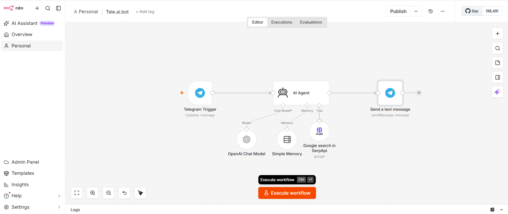
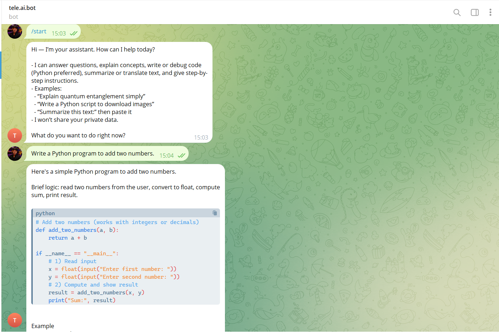
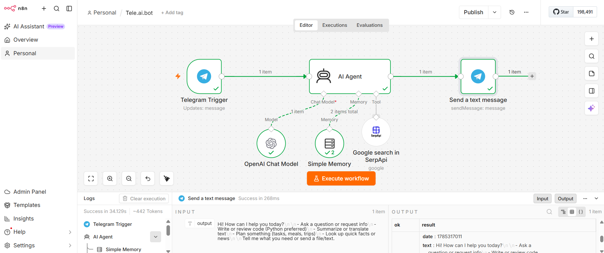

# Tele.ai.bot – AI-Powered Telegram Assistant

## Overview

Tele.ai.bot is an AI-powered Telegram assistant built using n8n, OpenAI GPT, Telegram Bot API, Simple Memory, and SerpAPI. The project demonstrates how an AI agent can maintain conversational context, use external tools for real-time information retrieval, and automatically respond to Telegram messages through an end-to-end workflow.

Unlike a traditional rule-based chatbot, the assistant leverages an LLM with memory and tool-calling capabilities, enabling more natural conversations while dynamically retrieving up-to-date information from Google Search whenever required.

The workflow is designed to showcase practical Agentic AI concepts including conversational memory, external tool integration, workflow automation, and intelligent response generation.

## Features

- AI-powered Telegram assistant
- Context-aware conversations using memory
- OpenAI GPT integration
- Google Search through SerpAPI
- Tool Calling with external APIs
- Automatic Telegram message handling
- End-to-end workflow automation
- Natural language understanding
- Real-time response generation
- Modular AI Agent architecture

## Architecture

```
Telegram User
      │
      ▼
Telegram Trigger
      │
      ▼
AI Agent
 ├── OpenAI Chat Model
 ├── Simple Memory
 └── SerpAPI (Google Search)
      │
      ▼
Telegram Send Message
```

## Workflow

The workflow starts when a user sends a message to the Telegram bot.

The Telegram Trigger captures the incoming message and forwards it to the AI Agent. The AI Agent processes the request using OpenAI GPT while maintaining conversational context through Simple Memory. Whenever external or real-time information is required, the agent automatically invokes SerpAPI to perform a Google Search.

After generating the final response, the workflow sends the answer back to the user through the Telegram Bot API.

This architecture demonstrates an Agentic AI workflow where the language model combines reasoning, conversational memory, and external tools before generating a response.

## Workflow Screenshot



## Telegram Conversation



## Execution

The screenshot below shows a successful workflow execution inside n8n.



## Technologies Used

- n8n
- OpenAI GPT
- Telegram Bot API
- SerpAPI
- Simple Memory
- AI Agents
- Workflow Automation
- LLM
- Prompt Engineering

## Repository Structure

```
tele-ai-bot/
│
├── README.md
├── LICENSE
├── .gitignore
│
├── workflow/
│   └── tele_ai_bot_workflow.json
│
└── screenshots/
    ├── workflow.png
    ├── telegram-chat.png
    └── execution.png
```

## Future Improvements

- Multi-user memory support
- Persistent database integration
- Voice message processing
- Document question answering
- Multi-language conversations
- Additional tool integrations
- Calendar and email automation
- Webhook-based integrations

## License

This project is released under the MIT License.
